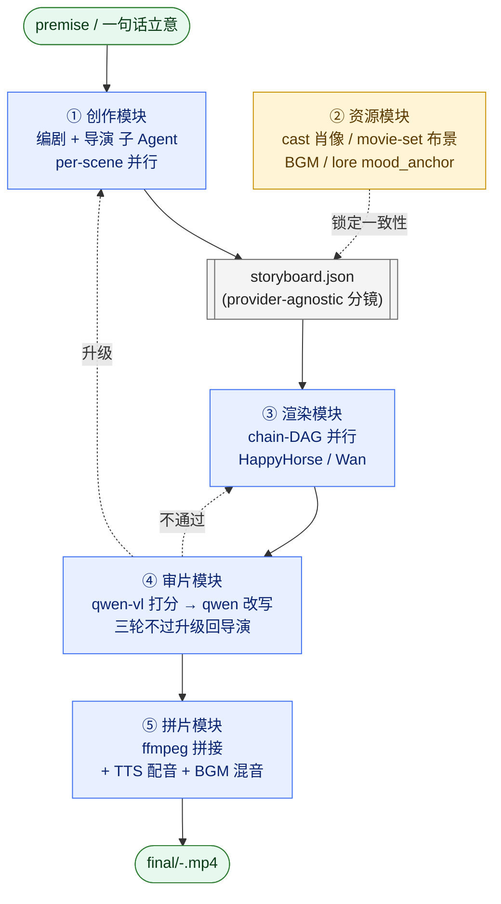
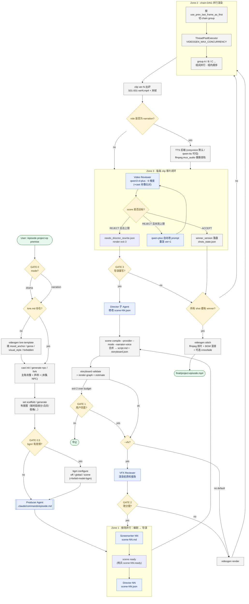
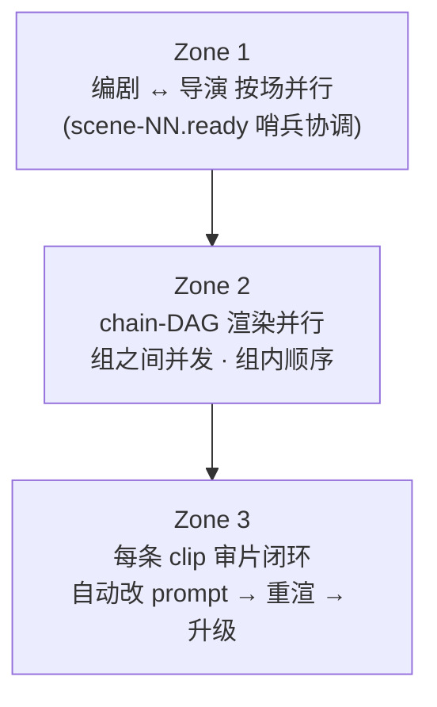
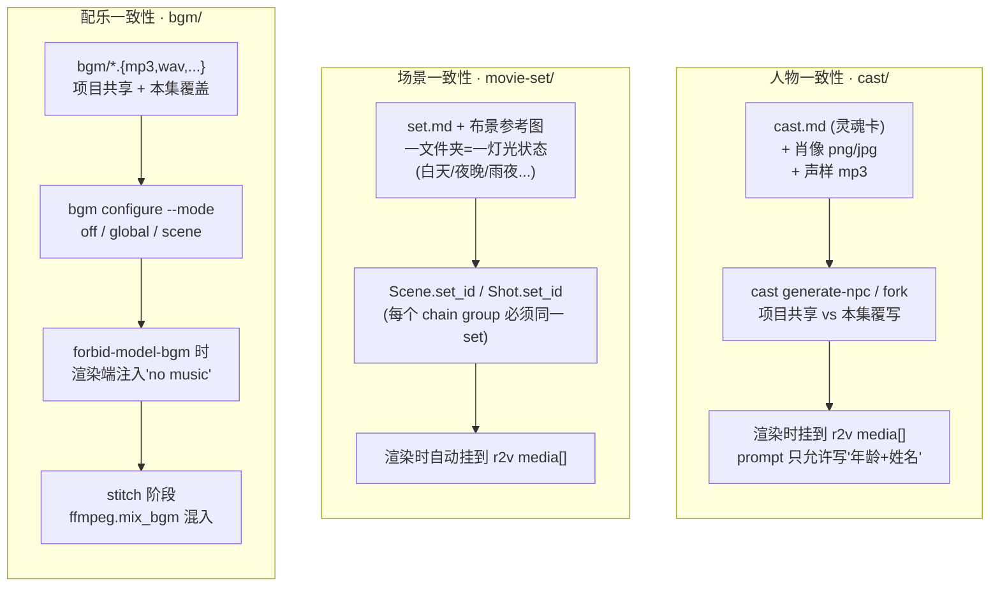

# videoGen 架构总览：一部短片是如何被造出来的

> 配套文档：`README.md`（用户入口） · `AGENTS.md` / `CLAUDE.md` / `QWEN.md`（Agent 行为规范） · `src/videogen/`（CLI 实现）

---

## 一、它是什么？

`videoGen` 是一个 **导演工具箱（director's toolbox）**，目标是借助阿里 DashScope 视频大模型造出 **3–10 分钟、人物形象保持一致、场景灯光保持一致** 的长片。

它解决的是单镜头视频模型用不了多久就"漂移"的痛点：

- 人脸抽卡 → 用 **cast 肖像 + r2v 参考图** 锁住角色
- 场景换灯 → 用 **movie-set 布景图** 锁住地点和时段
- 长片没配乐 → 用 **本地 BGM 库 + ffmpeg 混音** 接管音乐
- 长镜头逻辑跳脱 → 用 **每镜审片 + 自动改 prompt + 升级回导演** 形成闭环

整套系统由两层抽象支撑：

- **Provider 抽象层**（`src/videogen/providers/`）解耦 "创作" 与 "执行"，目前支持 `happyhorse-1.0`（默认）和 `wan2.7`。
- **多 Agent 协作层**（`.claude/skills/` + `.claude/commands/`）把"写剧本 / 分镜 / 审片"等创作角色拆成可并行子 Agent，由 CLI 串成流水线。

分镜（storyboard）写法是 **provider-agnostic** 的——每个镜头只声明通用 `kind`（`t2v` / `i2v` / `r2v`），渲染时再由 provider 映射到具体模型名。

一句话看清整条流水线由哪些模块组成：



五个模块各自的实现入口：① `.claude/skills/{screenwriter,video-director}` + `src/videogen/scene.py` · ② `src/videogen/{cast,movie_set,bgm,lore}.py` · ③ `src/videogen/{render,providers}` · ④ `src/videogen/{review,rewrite}.py` + `.claude/skills/video-reviewer` · ⑤ `src/videogen/{ffmpeg,tts}.py`。详细的子流程见后文"四、技术细节"。

---

## 二、怎么用？

### 2.1 两种制作模式

`/episode` 在最开始会停在 **GATE 0**，让你选模式：

| 模式 | 适用 | 工作方式 |
|------|------|----------|
| **`drama`（短剧）** *默认* | 2–5 分钟原创短片 | 每镜都是 15s 自包含长镜头，对白驱动、有完整声音 |
| **`narration`（旁白解说）** | "10 分钟带你看完 XX" 类长视频 | 编剧写"节拍"（旁白 + 对白混合）。旁白节拍变成 3–6s 短镜头，原声被剥掉，由 `cosyvoice-v3-flash`（默认；可切 `qwen3-tts-flash`）配音替换；对白节拍仍按 drama 方式渲染。旁白镜每条自成一个 chain group，**最大化并行度** |

### 2.2 两套视频模型（provider）

storyboard 不绑定模型，渲染时由 provider 决定具体调谁。

| Provider | 模型名 | 能力 |
|----------|--------|------|
| **HappyHorse 1.0** *默认* | `happyhorse-1.0-{t2v,i2v,r2v}` | 较新但能力较少 |
| **Wan 2.7** | `wan2.7-{t2v-2026-04-25,i2v-2026-04-25,r2v}` | 多 `reference_voice` / r2v `first_frame` 链接桥 / `negative_prompt` / `prompt_extend` |

选择优先级：`videogen render --provider` 标志 → `Storyboard.provider`（由 `scene compile --provider` 写入）→ `VIDEOGEN_VIDEO_PROVIDER` 环境变量 → 内置默认 `happyhorse`。

### 2.3 快速入门（一句话）

新 clone 完之后，直接在 Claude Code / Qwen Code 里喊：

```text
> /bootstrap
```

`/bootstrap`（`.claude/commands/bootstrap.md`）会让 agent 按顺序 **自检 + 自修**：

1. 系统依赖：检查 `ffmpeg` / `python3 ≥ 3.11`，macOS 上自动 `brew install ffmpeg`
2. Python 包：`./bin/videogen --version` 不通就自动 `pip install -e .`（优先复用 `.venv/`）
3. `.env`：缺则 `cp .env.example .env`，只在需要 `DASHSCOPE_API_KEY` 时找你要
4. 山音编剧/导演 SKILL：缺就跑 `bash scripts/install-shanyin-skills.sh`
5. git 预提交钩子（可选）：缺就跑 `bash scripts/install-hooks.sh`
6. 最后用 `./bin/videogen doctor` 兜底确认

整个过程是幂等的，已经装好的步骤会标 `PASS` 跳过；只有 API key 这类必须人工提供的项目才会停下来问你。

确认 `/bootstrap` 全绿后，在 Claude Code / Qwen Code 里继续：

```text
> /cast-init wulin 001
> /episode wulin 001 "明朝架空背景的搞笑武侠情景喜剧, 3 分钟, 佟掌柜和钱夫人结怨已深..."
```

也可以一次性钉死所有选择：

```text
> /episode wulin 001 "..." --mode=drama --provider=wan --vfx
> /episode wulin 001 "..." --mode=narration                     # 10 分钟解说风
```

### 2.4 用户决策点

整条流水线只在以下几个 **gate** 停下来等你确认，其余全自动：

| Gate | 触发条件 | 用户决策 |
|------|----------|----------|
| **GATE 0** | `/episode` 没带 `--mode` | drama 还是 narration |
| **GATE 0.5** | 检测到 `projects/<p>/bgm/` 或 `projects/<p>/<e>/bgm/` 有音频 | BGM 用法（off / global / scene）+ 是否禁止模型自带 BGM |
| **GATE 1** | `storyboard estimate` 超预算（默认 > 180s 渲染时间） | 是否继续 |
| **GATE 2** | 仅 `--vfx` 启用时 | 是否按 VFX Reviewer 报告回炉改分镜 |
| **GATE 3** | `render` exit 3（某镜重试到顶仍不过） | 是否让导演子 Agent 改剧本/分镜 |

---

## 三、成片示例

> ⬇️ 在这里放一段成片示例（mp4 / gif / 视频链接均可）

<!-- 在下方填入成片片段，例如：
<video src="docs/demo.mp4" controls width="720"></video>

或者：


-->

_占位：等待填入成片样本_

---

## 四、技术细节

### 4.1 多 Agent 制片团队

| 角色 | 文件 | 职责 | 输出 |
|------|------|------|------|
| **Producer（制片）** | `.claude/commands/episode.md` | 总调度、管 5 个用户 gate、扇出并行子 Agent | 协调 |
| **Screenwriter（编剧）** | `.claude/skills/screenwriter/SKILL.md`（包装"山音编剧大师"） | premise → 每场一个 `scenes/scene-NN.md` | 单场 markdown |
| **Director（导演）** | `.claude/skills/video-director/SKILL.md`（包装"山音导演大师"） | scene-NN.md → `scenes/scene-NN.json`（分镜片段） | 单场 JSON |
| **VFX Reviewer**（可选） | `.claude/skills/vfx-reviewer/SKILL.md` | 渲染前的分镜质检（`--vfx` 才开） | 报告 |
| **Video Reviewer** | `.claude/skills/video-reviewer/SKILL.md` | `qwen3-vl-plus` 在 6 维度（逻辑/比例/物理/风格/选角/台词归属）打 0-10 分，并把 cast 肖像喂给多模态请求来抓"换脸"和"台词错位" | `reviews/<shot>-verN.json` |
| **CLI** | `src/videogen/` | 调 API、上传 OSS、ffmpeg、并行渲染、审片、拼片、状态、TTS、BGM 混音 | clips + 成片 mp4 |

**硬性边界**：编剧不懂模型；导演不写剧本；reviewer 不改分镜；CLI 不做创作决策。

### 4.2 整体流程图



### 4.3 三个并行区

整条流水线在三个地方真正并行：



- **Zone 1**：不同场之间完全并行。约束：每场首镜必须 `use_prev_last_frame_as_first: false`，让后面的渲染 DAG 尽量宽。
- **Zone 2**：组之间用 `ThreadPoolExecutor` 并行（`VIDEOGEN_MAX_CONCURRENCY`，默认 4）；组内仍是顺序——后镜需要前镜的 last frame 当首帧。`render-graph` 可视化这张图。
- **Zone 3**：每条 clip 渲完立刻进入 review 闭环；只有真到 round = N 仍未过才升级回导演（GATE 3）。

### 4.4 一致性三大支柱

视频模型不稳，所以 prompt 里 **不** 解决一致性，靠下面三类外部资源锁定：



设计要点：

- **cast**：prompt 严禁出现"着装/发型/妆容/配饰"——这些会让模型漂；只允许出现 `年龄+姓名`（如 `28岁的陆辰`）。需要换装就 `cast fork` 单集覆写。
- **movie-set**：**一个文件夹 = 一种灯光状态**。同一地点跨时段必须拆成 `同福客栈大堂-白天` / `同福客栈大堂-夜晚` 等多个文件夹。Linter 强制 "同一 chain group 内 set_id 一致"。
- **BGM**：模型自带 BGM 和库内 BGM 会打架。默认开启 `forbid_model_bgm`，由 stitch 阶段统一混音；音轨注入时 dialog/TTS 原声保留，BGM 衰减 + 循环 + 适配时长。

### 4.5 文件系统模型

一个 **project** 是一部剧；一个 **episode** 是 ~3 分钟的短片。所有产物落在 `projects/<project>/<episode>/`，是 **单一事实源**：

```
projects/<project_id>/
├── lore.md                 ← 项目级世界观（episode 间共享）
├── cast/<name>/{cast.md,*.png,*.mp3}        ← 项目主角
├── movie-set/<name>/{set.md,*.png}          ← 项目复用布景（情景喜剧那种）
├── bgm/<track>.{mp3,wav,...}                ← 项目级 BGM
└── episode-001/
    ├── direction.json                       ← 本集导演定调（可选）
    ├── scenes/scene-NN.{md,ready,json}      ← Zone 1 并行产物
    ├── script.md / storyboard.json          ← scene compile 自动合并
    ├── cast.json + cast/<npc>/              ← 本集 NPC / 服装覆写
    ├── cast_built/                          ← ASCII 化的肖像 + grid
    ├── movie_set.json + movie-set/<set>/    ← 本集一次性布景
    ├── movie_set_built/                     ← 同上的构建产物
    ├── bgm/<track>.{...}                    ← 本集 BGM(同名覆盖项目级)
    ├── clips/S01-001-ver{1,2,3}.mp4         ← 多版本尝试
    ├── clips/S01-001.mp4                    ← winner 拷贝(stitch 用)
    ├── frames/S01-001-verN_last.png         ← 每次尝试的末帧
    ├── reviews/<shot>-verN.json             ← 评分 + critique + verdict
    ├── shots_state.json                     ← attempts[] + winner_version
    ├── needs_director_rewrite.json          ← 仅 render exit 3 时出现
    ├── final/<project>-<episode>.mp4
    └── logs/model_calls.jsonl               ← 所有模型调用的全量审计
```

### 4.6 关键模块速查（`src/videogen/`）

| 模块 | 角色 |
|------|------|
| `cli.py` | Typer 入口，所有子命令注册在这里 |
| `storyboard.py` | Pydantic schema（Scene / Shot / Storyboard / BGMConfig），是 schema 的单一事实源 |
| `scene.py` | 按场流水线：scaffold / ready / status / compile |
| `render.py` | chain-DAG 切片、ThreadPoolExecutor 并发渲染、review 闭环主控 |
| `providers/{base,wan,happyhorse,registry}.py` | provider 抽象 + 两个实现 + 注册表 |
| `review.py` | `qwen3-vl-plus` 6 维度打分 |
| `rewrite.py` | `qwen-plus` 失败时自动改写 prompt |
| `tts.py` | 旁白配音（narration 模式）。按 `VIDEOGEN_NARRATOR_TTS_MODEL` 名前缀路由两套后端：`cosyvoice-*`（默认，**仅北京**）走 `/services/audio/tts/SpeechSynthesizer` 原生 `rate`；`qwen*-tts*`（兼容）走 `/services/aigc/multimodal-generation/generation` + ffmpeg `atempo` |
| `bgm.py` | 本地 BGM 发现 + 路径解析 + 与 storyboard.bgm 联动 |
| `movie_set.py` | 布景文件夹 → set.json + 构建产物 |
| `cast.py` / `npc.py` / `soul.py` | 主角池、NPC 生成、灵魂卡模板 |
| `lore.py` | 项目级世界观读写、mood_anchor 拼接 |
| `upload.py` | 本地文件 → OSS URL |
| `ffmpeg.py` | 末帧提取、拼片、`mux_audio`、`mix_bgm` |
| `state.py` | 每集 JSON 状态读写 |
| `model_log.py` | `logs/model_calls.jsonl` 全量审计写入 |
| `config.py` | 环境变量 + region 路由 |

---

## 五、几个关键设计取舍

1. **per-scene 文件 + sentinel** 解锁 Zone 1 真并行——编剧/导演不再卡在"全剧本写完"那个全局 barrier 上。
2. **provider-agnostic storyboard** 让同一份分镜一键切 happyhorse / wan；duration 下限、`reference_voice`、`first_frame` 链等差异都封在 `providers/{base,wan,happyhorse}.py` 里。
3. **review + auto-rewrite + 升级到导演** 三级闭环：CLI 能自我修复 prompt 级问题，只有真正剧情/分镜级问题才升级到人类或更高 Agent。
4. **一致性靠外部锚点不靠 prompt**：cast / movie-set / BGM 三套外部资源各管一摊；prompt 只写故事，不写"穿什么/在哪/什么音乐"——这是长片不漂的核心。
5. **narration 模式用 TTS 兜底长片**：把"长视频模型连贯性差"这件事交给配音 + 短视觉，最大化并行（每个旁白镜独立 chain group），同时保证叙事完整。
6. **`logs/model_calls.jsonl`** 全量审计每次模型调用（请求/响应/耗时/shot/version）——长片调试和成本归因都靠它。
7. **CLI 是哑执行体**（`./bin/videogen` shim）——所有创作决策在 Agent 那一层，CLI 只负责"做对的事"，不"决定该做什么"。

---

## 六、关键配置（`.env`）

| Var | Default | Meaning |
|-----|---------|---------|
| `VIDEOGEN_VIDEO_PROVIDER` | `happyhorse` | `happyhorse` \| `wan`，全局默认 provider |
| `VIDEOGEN_MAX_CONCURRENCY` | `4` | Zone 2 并行 chain group 数 |
| `VIDEOGEN_REVIEW_THRESHOLD` | `7.0` | ACCEPT 分数线 |
| `VIDEOGEN_REVIEW_MODEL` | `qwen3-vl-plus` | 空串 → 关闭 review |
| `VIDEOGEN_REWRITE_MODEL` | `qwen-plus` | 空串 → 关闭 auto-rewrite |
| `VIDEOGEN_MAX_RETRY` | `3` | 升级前每个 shot 的最大重试轮数 |
| `VIDEOGEN_LONG_CONFIRM_S` | `180` | `storyboard estimate` 超此值 exit 2 |
| `VIDEOGEN_NARRATOR_TTS_MODEL` | `cosyvoice-v3-flash` | 旁白 TTS 模型。按前缀路由后端：`cosyvoice-*` 走 CosyVoice 端点 + 原生 `rate`（仅北京）；`qwen*-tts*` 走 Qwen-TTS + ffmpeg atempo |
| `VIDEOGEN_NARRATOR_VOICE` | `longanyang` | narration 默认嗓音，须与所选后端匹配（CosyVoice：`longanyang`/`longwan`/…；Qwen-TTS：`Cherry`/`Ethan`/…）。`Storyboard.narrator_voice` / `Shot.narrator_voice` 可覆盖 |
| `VIDEOGEN_NARRATOR_SPEECH_RATE` | `1.2` | 语速（0.5–2.0）。CosyVoice 原生消化；Qwen-TTS 走 ffmpeg `atempo` 后处理 |
| `VIDEOGEN_NARRATOR_LANGUAGE` | `Auto` | 单语场景指定语言可提升发音；CosyVoice 不支持 Italian/Spanish 时退化为自动识别 |
