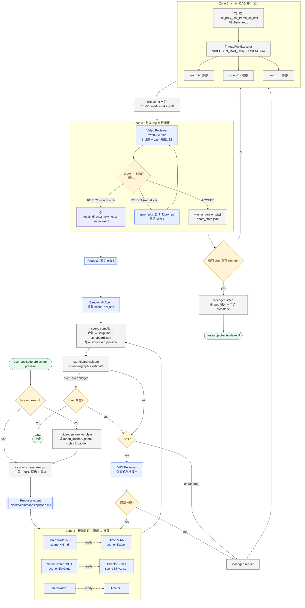

# videoGen 架构总结：一部短片是如何被造出来的

> 配套文档：`AGENTS.md`（agent 行为规范） · `README.md`（用户入口） · `src/videogen/`（CLI 实现）

---

## 一、项目定位

`videoGen` 是一个 **导演工具箱（director's toolbox）**，目标是用阿里 DashScope 视频大模型生成 **3–10 分钟、人物形象保持一致** 的长片。它通过两层抽象解耦了"创作"和"执行"：

- **Provider 抽象层**（`src/videogen/providers/`）：屏蔽具体视频模型差异，目前支持 `happyhorse-1.0`（默认）和 `wan2.7`。
- **多 Agent 协作层**（`.claude/skills/` + `.claude/commands/`）：把"写剧本 / 分镜 / 审片"等创作角色拆成可并行的子 Agent，由 CLI 串成流水线。

分镜（storyboard）写法是 **provider-agnostic** 的——每个镜头只声明通用 `kind`（`t2v` / `i2v` / `r2v`），渲染时再由 provider 映射到具体模型名。

---

## 二、整体流程图（Mermaid）



---

## 三、多 Agent 制片团队

| 角色 | 文件 | 职责 | 输出 |
|------|------|------|------|
| **Producer（制片人）** | `.claude/commands/episode.md` | 总调度、4 个用户 gate、扇出并行子 Agent | 协调 |
| **Screenwriter（编剧）** | `.claude/skills/screenwriter/SKILL.md`（包装"山音编剧大师"） | premise → 每场一个 `scenes/scene-NN.md` | 单场 markdown |
| **Director（导演）** | `.claude/skills/video-director/SKILL.md`（包装"山音导演大师"） | scene-NN.md → `scenes/scene-NN.json`（分镜片段） | 单场 JSON |
| **VFX Reviewer**（可选） | `.claude/skills/vfx-reviewer/SKILL.md` | 渲染前的分镜质检（`--vfx` 才开） | 报告 |
| **Video Reviewer** | `.claude/skills/video-reviewer/SKILL.md` | `qwen3-vl-plus` 在 6 维度（逻辑/比例/物理/风格/选角/台词归属）打 0-10 分 | `reviews/<shot>-verN.json` |
| **CLI** | `src/videogen/` | 调 API、上传 OSS、ffmpeg、并行渲染、审片、拼片、状态 | clips + 成片 mp4 |

**硬性边界**：编剧不懂模型；导演不写剧本；reviewer 不改分镜；CLI 不做创作决策。这种"角色不越界"是项目能稳定跑长片的关键。

---

## 四、文件系统模型：project + episode

一个 **project** 是一部剧；一个 **episode** 是一段 ~3 分钟的短片。所有产物都落在 `projects/<project>/<episode>/` 下，形成"单一事实源"：

```
projects/<project_id>/
├── lore.md              ← 项目级世界观（所有 episode 共享）
├── cast/                ← 项目主角（共享）
└── episode-001/
    ├── scenes/scene-NN.{md,ready,json}   ← Zone 1 并行产物
    ├── script.md / storyboard.json       ← 由 scene compile 自动合并
    ├── cast.json / cast/ / cast_built/   ← 本集 NPC + 拼图
    ├── clips/ S01-001-ver{1,2,3}.mp4     ← 多版本尝试 + winner 拷贝
    ├── frames/                           ← 每次尝试的最后一帧
    ├── reviews/<shot>-verN.json          ← 评分 + critique + verdict
    ├── shots_state.json                  ← attempts[] + winner_version
    ├── needs_director_rewrite.json       ← render exit 3 时才有
    ├── final/<project>-<episode>.mp4
    └── logs/model_calls.jsonl            ← 所有模型调用的全量审计
```

---

## 五、端到端流程（一句话概括 + 五步详解）

> **一句话**：编剧和导演按场并行写出 provider-agnostic 分镜 → CLI 按 chain DAG 并行渲染 → 每条 clip 即时审片，过则收，不过则自动改 prompt 重渲，三轮还不过就升级回导演 → 最后拼片成 mp4。

### Step 0 — 项目奠基（一次性）
- `videogen lore template/show/validate`：写好 `projects/<p>/lore.md`，至少填 `mood_anchor`、`genre`、`visual_style`、`forbidden`。
- `lore.mood_anchor` 之后会被 **逐字追加到每一个镜头 prompt**——长片视觉一致性的最大杠杆。
- `cast soul template` / `cast generate-npc`：生成项目主角的肖像 + 声样。

### Step 1 — Zone 1：编剧 ↔ 导演 按场并行
- Producer 把 premise 拆成 N 场，对每一场扇出一对子 Agent：
  - **编剧** 写 `scenes/scene-NN.md`，写完落 `scene-NN.ready` 哨兵。
  - **导演** 一旦看到 `.ready` 就开工，输出 `scenes/scene-NN.json`。
- 不同场之间 **完全并行**。
- 关键约束：**每场首镜必须 `use_prev_last_frame_as_first: false`**，让后面的渲染 DAG 尽量宽。
- `videogen scene compile` 把所有 `scenes/*.{md,json}` 合并成 `script.md` + `storyboard.json`，并把 `--provider` 烙进 `storyboard.provider`。

### Step 2 —（可选）VFX Review 渲染前质检
- 默认 **跳过**；只有 `--vfx` 才跑。
- 它只读不写，找出分镜级问题，由 producer 决定是否回炉。

### Step 3 — Zone 2：链式 DAG 并行渲染
- `videogen storyboard validate` + `storyboard estimate`（超预算 exit 2）+ `render-graph`（亮出并行 group 数）。
- `videogen render` 把分镜按 `use_prev_last_frame_as_first` 切成多个 **chain group**：
  - **组之间** 用 `ThreadPoolExecutor` 并行（`VIDEOGEN_MAX_CONCURRENCY`，默认 4）。
  - **组内仍是顺序**——后镜要拿前镜的 last frame 当首帧。

### Step 4 — Zone 3：每条 clip 审片 + 自动改写 + 升级
渲染完一条 clip 立即过 review 闭环：

1. `qwen3-vl-plus` 在 6 维度打分，并把 cast 肖像也喂进多模态请求，专门抓"换脸"和"台词错位"。
2. **ACCEPT**（≥ `VIDEOGEN_REVIEW_THRESHOLD`，默认 7.0）→ 写入 `winner_version`。
3. **REJECT 且 round < N**（默认 N=3）→ CLI 自动用 `qwen-plus` 改写 prompt，重渲一版（ver2、ver3…）。
4. **REJECT 且 round = N** → 写 `needs_director_rewrite.json`，进程 exit 3 → producer 把球踢回 **导演子 Agent** 做剧本/分镜级修改。
5. 全部尝试都不达标时挑 **best-of-N** 当 winner（可用 `--allow-below-threshold` 强行拼片）。

### Step 5 — 拼片成片
- `videogen stitch` 用 ffmpeg 把每个 shot 的 winner 拼成 `final/<project>-<episode>.mp4`，可加 `--crossfade`。

---

## 六、几个关键设计取舍

1. **per-scene 文件 + sentinel** 解锁了 Zone 1 的真并行——编剧和导演不再卡在"全剧本写完"这一个全局 barrier 上。
2. **provider-agnostic storyboard** 让同一份分镜可以一键切 happyhorse / wan，无需改文案；`src/videogen/providers/{base,wan,happyhorse}.py` 各自处理 duration 下限、`reference_voice`、`first_frame` 链接等差异。
3. **review + auto-rewrite + 升级到导演** 三级闭环，是把"AI 视频质量不稳定"工程化的核心：CLI 能自我修复 prompt 级问题，只有真正剧情/分镜级问题才打扰人类（或更高 Agent）。
4. **`logs/model_calls.jsonl`** 全量审计每次模型调用（请求/响应/耗时/shot/version）——长片调试和成本归因都靠它。
5. **CLI 是哑执行体**（`./bin/videogen` shim）——所有创作决策在 Agent 那一层，CLI 只负责"做对的事"，不"决定该做什么"。

---

## 七、关键配置（`.env`）

| Var | Default | Meaning |
|-----|---------|---------|
| `VIDEOGEN_VIDEO_PROVIDER` | `happyhorse` | `happyhorse` \| `wan`，全局默认 |
| `VIDEOGEN_MAX_CONCURRENCY` | `4` | Zone 2 并行 chain group 数 |
| `VIDEOGEN_REVIEW_THRESHOLD` | `7.0` | ACCEPT 分数线 |
| `VIDEOGEN_REVIEW_MODEL` | `qwen3-vl-plus` | 空串 → 关闭 review |
| `VIDEOGEN_REWRITE_MODEL` | `qwen-plus` | 空串 → 关闭 auto-rewrite |
| `VIDEOGEN_MAX_RETRY` | `3` | 升级前每个 shot 的最大重试轮数 |
